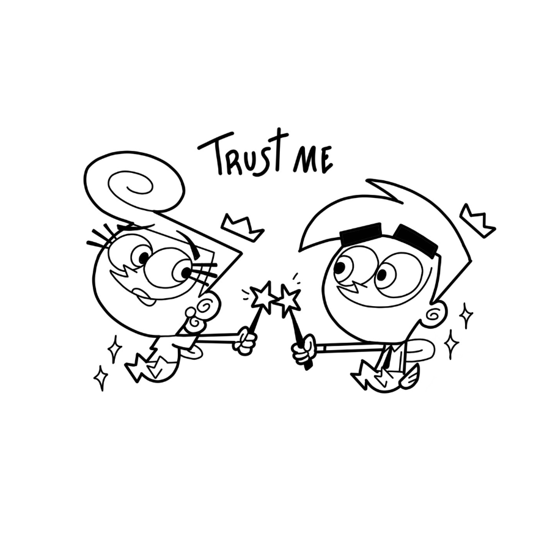

# Not Found Ink - Colección NFT



## 🌐 Despliegue

La aplicación está desplegada y disponible en: [https://notfoundink.vercel.app/](https://notfoundink.vercel.app/)

Visita el sitio para explorar la colección completa y mintear tus NFTs favoritos.

## 🎨 Descripción

"Not Found Ink" es una colección única de 100 NFTs creados por la talentosa ilustradora Ana María, que fusiona el estilo icónico de Los Simpson y Futurama con la irreverencia de Shin Chan y elementos de la cultura japonesa. Cada pieza es única y está disponible exclusivamente en la blockchain de Solana, utilizando un sistema de candy machine para garantizar una distribución justa.

## ✨ Características

- **Diseño Único**: Cada NFT combina estilos de Los Simpson, Futurama y Shin Chan con toques japoneses
- **Experiencia Web Inmersiva**: Interfaz atractiva con animaciones y efectos visuales
- **Integración con Solana**: Sistema de mint basado en la blockchain de Solana
- **Responsive Design**: Experiencia optimizada para todos los dispositivos (móvil, tablet y escritorio)
- **Visualización en 3 Columnas**: Diseño especial para dispositivos móviles que mantiene 3 columnas
- **Rotación de NFTs**: Previsualización dinámica de NFTs en la página de mint

## 🚀 Tecnologías Utilizadas

### Frontend
- **Next.js 15**: Framework React con renderizado del lado del servidor
- **React 19**: Biblioteca para construir interfaces de usuario
- **TypeScript**: Superset tipado de JavaScript
- **Tailwind CSS**: Framework CSS utility-first para diseño rápido y responsivo

### Despliegue
- **Vercel**: Plataforma de despliegue optimizada para aplicaciones Next.js
- **GitHub**: Control de versiones y CI/CD automático

### Componentes UI
- **Radix UI**: Componentes accesibles y sin estilos para React
- **Lucide Icons**: Conjunto de iconos SVG
- **Embla Carousel**: Carruseles modernos y accesibles
- **React Day Picker**: Selector de fechas para React
- **Sonner**: Notificaciones toast modernas

### Animaciones
- **Tailwind CSS Animate**: Extensión de Tailwind para animaciones
- **CSS Animations**: Animaciones personalizadas para efectos visuales

### Blockchain
- **Solana Web3.js**: Biblioteca para interactuar con la blockchain de Solana
- **Candy Machine**: Sistema para distribución de NFTs en Solana

## 📱 Responsive Design

La aplicación está diseñada para ofrecer una experiencia óptima en todos los dispositivos:

- **Móvil**: Diseño de 3 columnas con espaciado reducido
- **Tablet**: Diseño adaptativo con espaciado medio
- **Escritorio**: Experiencia completa con espaciado amplio

## 🖥️ Páginas Principales

- **Home**: Presentación de la colección y NFTs destacados
- **Colección**: Galería completa de NFTs con filtros de búsqueda
- **Mint**: Interfaz para adquirir NFTs con previsualización dinámica
- **Artista**: Información sobre la creadora y sus inspiraciones
- **NFT Individual**: Vista detallada de cada NFT

## 🛠️ Instalación y Uso

### Requisitos Previos
- Node.js 18.0 o superior
- npm o yarn

### Instalación

```bash
# Clonar el repositorio
git clone https://github.com/420btc/notfoundink.git

# Navegar al directorio del proyecto
cd notfoundink

# Instalar dependencias
npm install
# o
yarn install

# Iniciar el servidor de desarrollo
npm run dev
# o
yarn dev
```

La aplicación estará disponible en `http://localhost:3000`

### Compilación para Producción

```bash
# Construir la aplicación para producción
npm run build
# o
yarn build

# Iniciar la aplicación en modo producción
npm start
# o
yarn start
```

## 📝 Estructura del Proyecto

```
notfoundink/
├── app/                  # Páginas de la aplicación
│   ├── admin/            # Panel de administración
│   ├── api/              # Endpoints de API
│   ├── artist/           # Página del artista
│   ├── collection/       # Galería de la colección
│   ├── marketplace/      # Mercado secundario
│   ├── mint/             # Página de minteo de NFTs
│   ├── nft/              # Vistas individuales de NFTs
│   ├── profile/          # Perfil de usuario
│   ├── globals.css       # Estilos globales
│   ├── layout.tsx        # Layout principal
│   └── page.tsx          # Página de inicio
├── components/           # Componentes reutilizables
│   ├── connect-wallet.tsx # Componente para conectar wallet
│   ├── mint-button.tsx   # Botón de minteo
│   └── wallet-provider-adapter.tsx # Proveedor de wallet
├── lib/                  # Utilidades y funciones
│   ├── candy-machine.ts  # Integración con Candy Machine v2
│   └── connection.ts     # Utilidades de conexión a Solana
├── public/               # Archivos estáticos
└── .env.local            # Variables de entorno
```

## 🍬 Integración con Candy Machine v2

La aplicación integra Candy Machine v2 de Solana para la distribución de NFTs. A continuación se detalla cómo funciona esta integración:

### Componentes Principales

1. **Wallet Provider Adapter**: Integra los adaptadores de wallet de Solana (Phantom, Solflare) para permitir a los usuarios conectar sus wallets.

2. **Candy Machine Client**: Gestiona la comunicación con el programa de Candy Machine en la blockchain de Solana.

3. **Mint Button**: Maneja el proceso de minteo de NFTs, incluyendo la creación de transacciones y la gestión de errores.

### Configuración de Candy Machine

Para configurar la Candy Machine, es necesario:

1. Crear una Candy Machine en la red de Solana (devnet o mainnet).
2. Configurar las variables de entorno en el archivo `.env.local`:

```env
# Solana Network (mainnet-beta, testnet, devnet)
NEXT_PUBLIC_SOLANA_NETWORK=devnet

# Candy Machine ID
NEXT_PUBLIC_CANDY_MACHINE_ID=<ID_DE_TU_CANDY_MACHINE>

# Fecha de lanzamiento (timestamp en segundos)
NEXT_PUBLIC_CANDY_START_DATE=<TIMESTAMP>

# Precio en SOL (en lamports, 1 SOL = 1,000,000,000 lamports)
NEXT_PUBLIC_CANDY_PRICE=<PRECIO_EN_LAMPORTS>
```

### Proceso de Minteo

El proceso de minteo sigue estos pasos:

1. El usuario conecta su wallet a través del componente `ConnectWallet`.
2. La aplicación verifica si la Candy Machine está activa y disponible.
3. El usuario hace clic en el botón de minteo.
4. Se crea y firma una transacción de minteo.
5. La transacción se envía a la red de Solana.
6. Se muestra una confirmación al usuario cuando la transacción es exitosa.

### Visualización en Dispositivos Móviles

Siguiendo las preferencias del usuario, la aplicación mantiene un diseño de 3 columnas en dispositivos móviles en todas las páginas, incluyendo la página de mint, para proporcionar una experiencia visual consistente.
not-found-ink/
├── app/                    # Rutas y páginas de la aplicación
│   ├── admin/              # Panel de administración
│   ├── api/                # Endpoints de API
│   ├── artist/             # Página del artista
│   ├── collection/         # Galería de la colección
│   ├── mint/               # Página de mint
│   ├── nft/                # Página de detalle de NFT
│   ├── globals.css         # Estilos globales
│   ├── layout.tsx          # Layout principal
│   └── page.tsx            # Página principal
├── components/             # Componentes reutilizables
│   ├── ui/                 # Componentes de UI básicos
│   ├── connect-wallet.tsx  # Componente de conexión wallet
│   ├── countdown-timer.tsx # Temporizador de cuenta regresiva
│   ├── footer.tsx          # Pie de página
│   ├── navbar.tsx          # Barra de navegación
│   ├── video-player.tsx    # Reproductor de video
│   └── wallet-provider.tsx # Proveedor de wallet
├── hooks/                  # Custom hooks
├── lib/                    # Utilidades y funciones auxiliares
├── public/                 # Archivos estáticos
│   ├── images/             # Imágenes de NFTs y UI
│   └── videos/             # Videos promocionales
├── styles/                 # Estilos adicionales
├── next.config.mjs         # Configuración de Next.js
├── package.json            # Dependencias y scripts
├── tailwind.config.ts      # Configuración de Tailwind CSS
└── tsconfig.json           # Configuración de TypeScript
```

## 🔗 Enlaces

- [Instagram](https://www.instagram.com/notfoundink/)
- [Twitter](https://twitter.com)
- [GitHub](https://github.com/420btc/notfoundink)

## 📄 Licencia

© 2025 Ana María. Todos los derechos reservados.

---

Desarrollado con ❤️ y ✨ por Ana María
